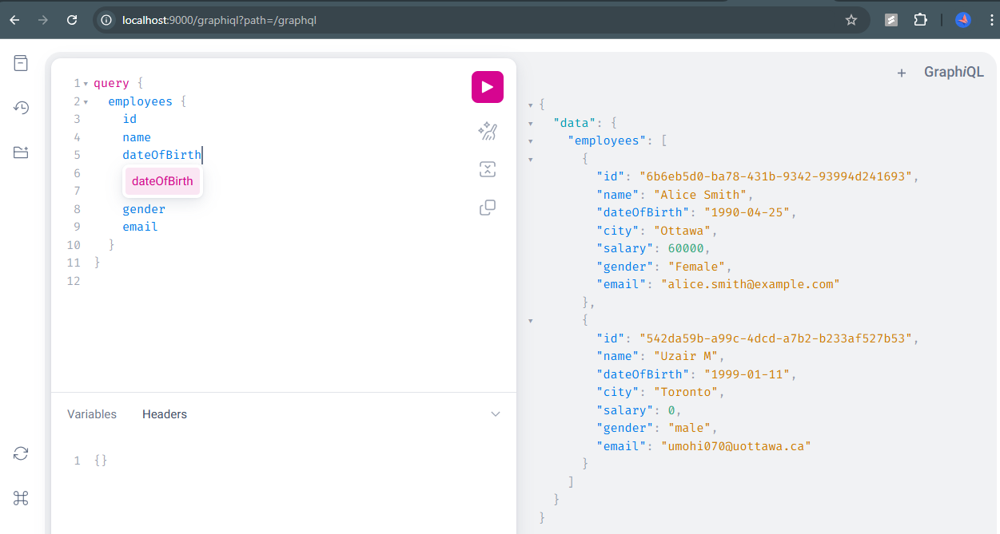
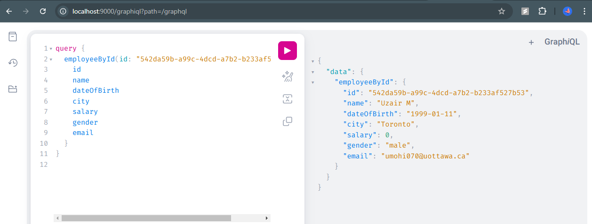
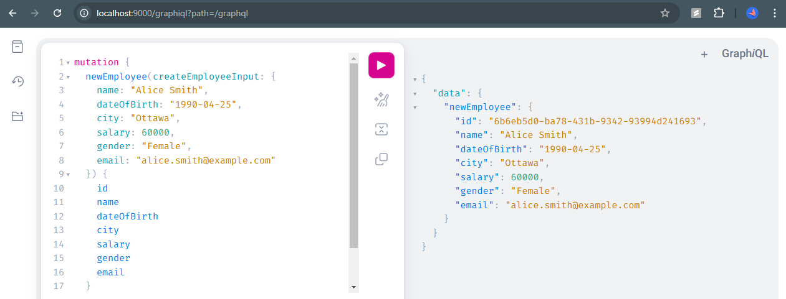
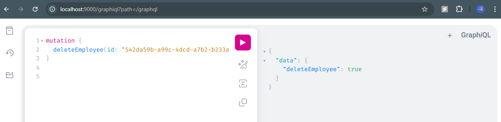

# Employee Application (employeeGql): GraphQL
- Name: Uzair Mohiuddin
- Student No: 8737165
- Email: umohi070@uottawa.ca

## GraphiQL: Query Employees

## GraphiQL: Query by ID

## GraphiQL: Mutation to create employee

## GraphiQL: Mutation to delete employee
